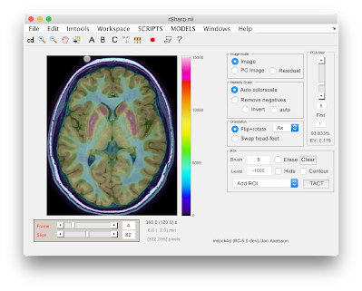

imlook4d
========

Introduction
------------

Imlook4d started as a viewer for 4-dimensional viewer for medical PET, CT, MRI
images, but has for more than a decade evolved to include tools typically not
available. The most important feature is the easy method to extend functionality
by adding a single matlab file into a folder (resulting in it becoming an
integrated menu in imlook4d)

Tell me about your use case, and give some feedback. [Mail me
here](mailto:axelsson.jan@gmail.com).

*Figure: imlook4d PET/MRI with applied temporal Hotelling filter*

Install
-------

[Register
here](https://docs.google.com/forms/viewform?hl=sv&id=1r-sMEdU94hLp7M_old8AhXE10FLTS6ARFFVNNRJUo8k).
Not required, but I would enjoy knowing who used the software. No spam.

**Download:**

Pre-release version 5 (recommended):  
[imlook4d version
5.0.0-rc18](https://drive.google.com/uc?export=download&id=12uG7-vkIFHpvWtMohuo3O-oszpjFGL98)

**Install:**

Install by saving and unzipping. Then in Matlab, press "Path" button, and "Add
with subfolders" to let Matlab recognize imlook4d.

**Run:**

Type `imlook4d` in Matlab window, and select a file to open

**Older versions:**  
version
[4.00](https://drive.google.com/uc?export=download&id=1bd8wU3xyp3N3cBktFsv3wMY4X6CRzmpI)

Features
--------

The program is developed in Matlab

Some features of imlook4d:

-   Full 4D VOI analysis, using brush tool (easier than polygons), and
    thresholded brushing.

-   DICOM, Nifti, Analyze, ECAT (very fast compared to Matlabs routines), and
    reads binary, interfile and some other formats

-   Export/Import to Matlab, gives full access to data in Matlab workspace

-   Drop-in SCRIPTS  makes it easy to add matlab code to imlook4d menues

-   Some 30 useful scripts for Matrix and ROI manipulations

-   Interactive help, click on the GUI or menu, and a detailed help opens

**Requirements:**  Windows, Linux or MacOS, and Matlab with no extra toolboxes

Advanced user
-------------

Most users will not miss these features.  Some experimental SPM-based scripts,
and export/import to ImageJ requires the following downloads:

-   [SPM home page](http://www.fil.ion.ucl.ac.uk/spm/)

-   ImageJ: [Fiji version](https://fiji.sc/) or [ImageJ
    version](https://imagej.nih.gov/ij/download.html)
