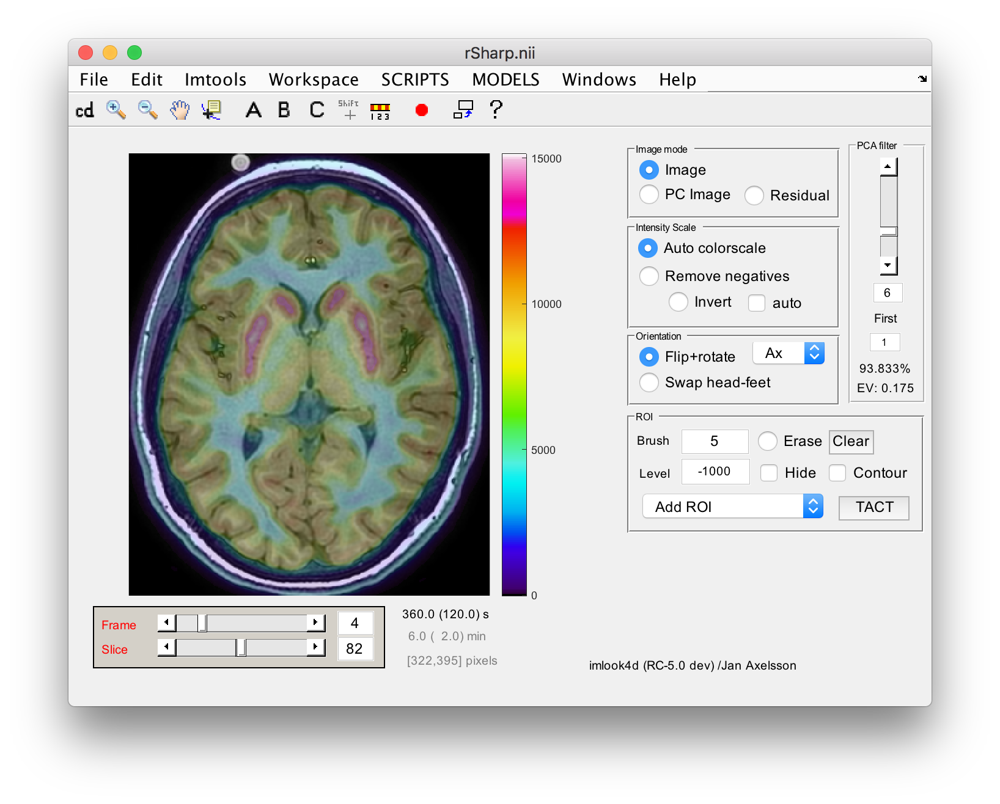

imlook4d
========

Introduction
------------

Imlook4d started as a viewer for 4-dimensional viewer for medical PET, CT, MRI
images, but has for more than a decade evolved to include tools typically not
available. The most important feature is the easy method to extend functionality
by adding a single matlab file into a folder (resulting in it becoming an
integrated menu in imlook4d)

*Figure: imlook4d PET/MRI with applied temporal Hotelling filter*

Install
-------

Easy method:  Download from the imlook4d web site
([https://sites.google.com/site/imlook4d](https://sites.google.com/site/imlook4d))

 

Advanced user:  Clone this repository

 

Features
--------

The program is developed in Matlab

Some features of imlook4d:

-   Full 4D VOI analysis, using brush tool (easier than polygons), and
    thresholded brushing.

-   DICOM, Nifti, Analyze, ECAT (very fast compared to Matlabs routines), and
    reads binary, interfile and some other formats

-   Export/Import to Matlab, gives full access to data in Matlab workspace

-   Drop-in SCRIPTS makes it easy to add matlab code to imlook4d menues

-   Some 30 useful scripts for Matrix and ROI manipulations

-   Support for ImageJ and SPM

-   Interactive help, click on the GUI or menu, and a detailed help opens

**Requirements:** Windows, Linux or MacOS, and Matlab with no extra toolboxes
